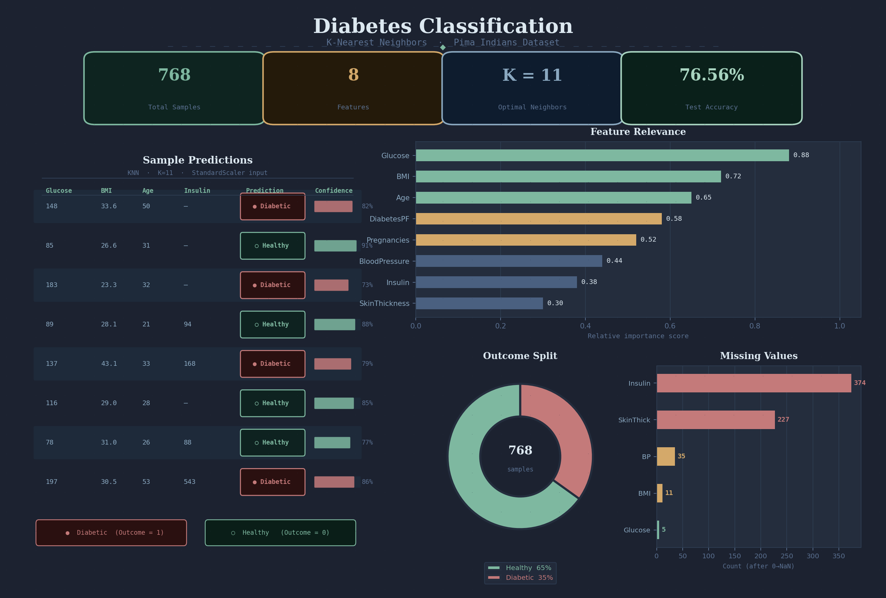
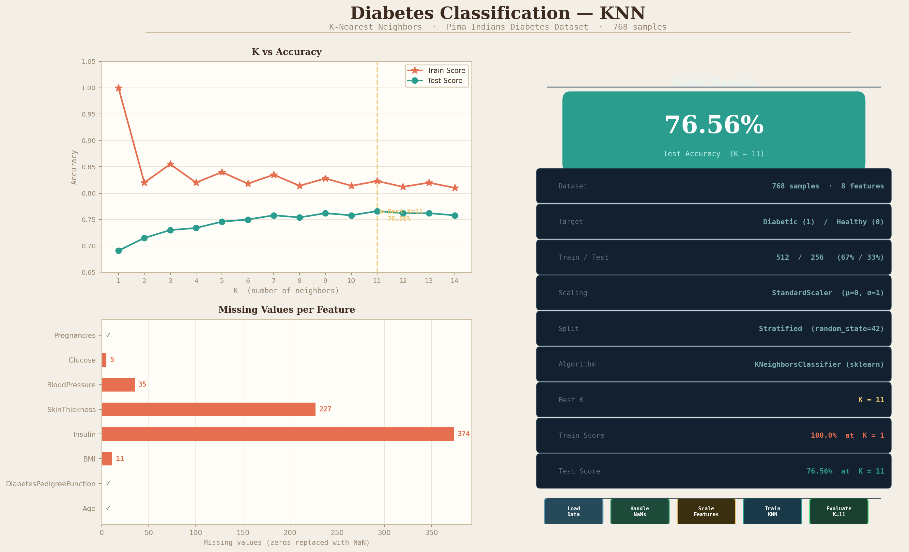
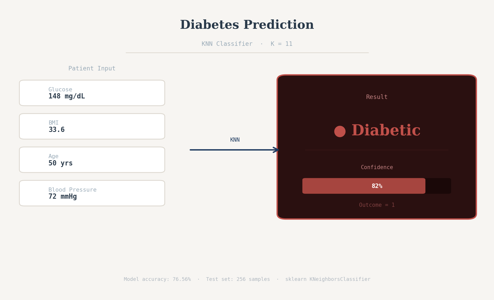

#  Diabetes Classification using KNN

A Machine Learning project that predicts whether a patient has diabetes using the K-Nearest Neighbors (KNN) algorithm based on medical diagnostic data.

---

##  Overview

The Diabetes Classification project focuses on analyzing medical data and building a classification model to predict whether a patient has diabetes.

This project demonstrates:

-  Supervised Machine Learning  
-  Data preprocessing & analysis  
-  Classification algorithms (KNN)  
-  Model evaluation  

KNN is a supervised learning algorithm that classifies data based on the closest neighboring data points.

---

##  Disclaimer

This project is for **educational purposes only**  
and should **NOT** be used for real medical diagnosis.

---

##  Features

-  Analyze medical dataset  
-  Predict diabetes using KNN model  
-  Data preprocessing and cleaning  
-  Model evaluation (accuracy, confusion matrix, etc.)  
-  Simple and effective ML pipeline  

---

##  Tech Stack

- Python  
- Scikit-learn  
- Pandas  
- NumPy  
- Matplotlib / Seaborn  

---

##  Screenshots

###  Model Workflow / Plan


###  Example Case Input


###  Model Output


---

##  Getting Started

### Prerequisites
- Python 3.x  
- Jupyter Notebook (optional)  

### Installation

```bash
git clone https://github.com/AliSayed15/diabetes-classification-knn.git
cd diabetes-classification-knn
pip install -r requirements.txt
jupyter notebook
